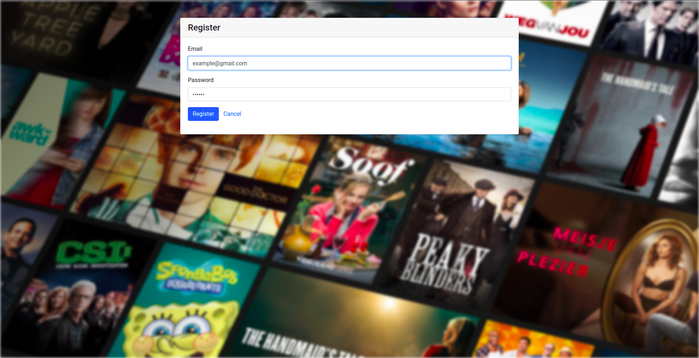
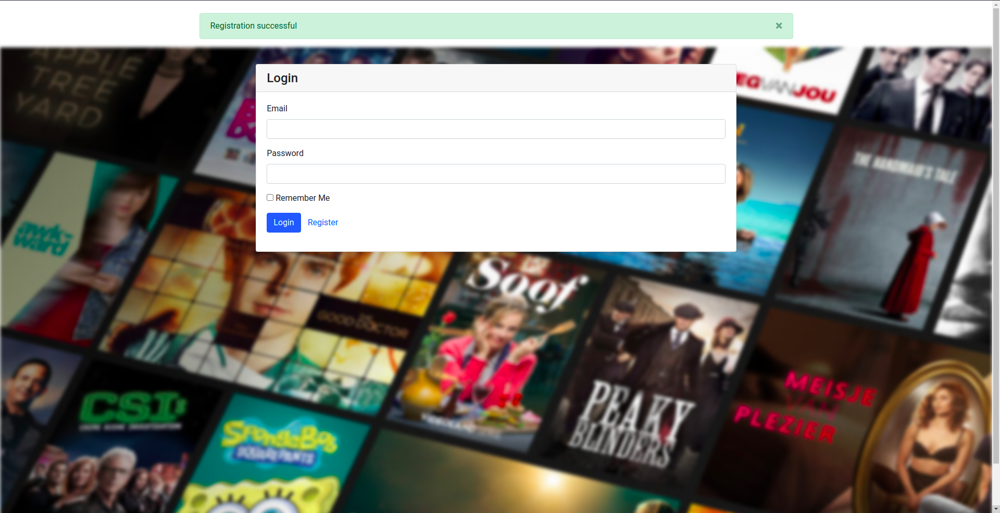
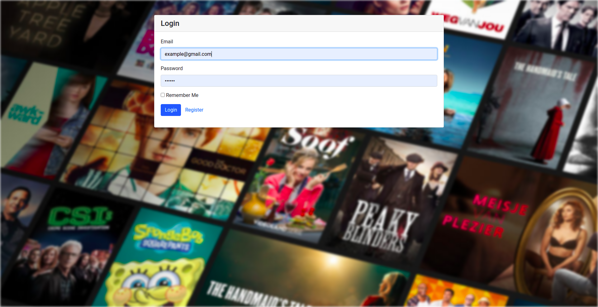
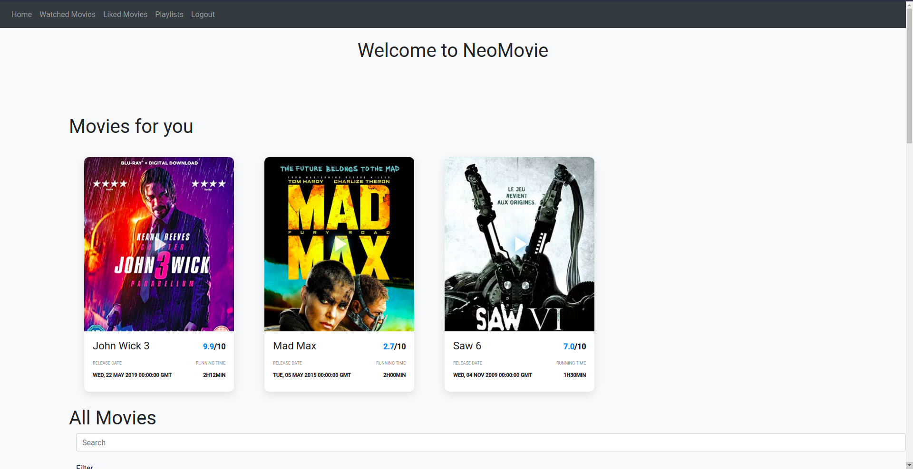
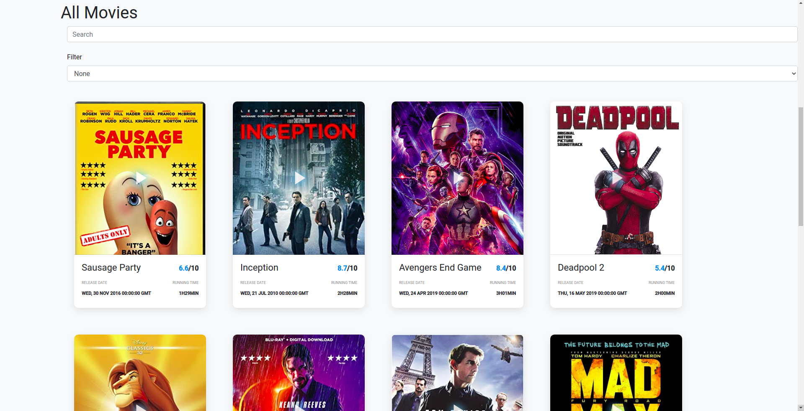
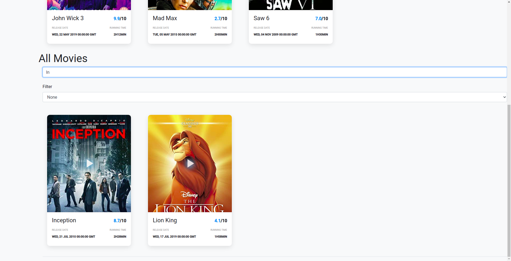
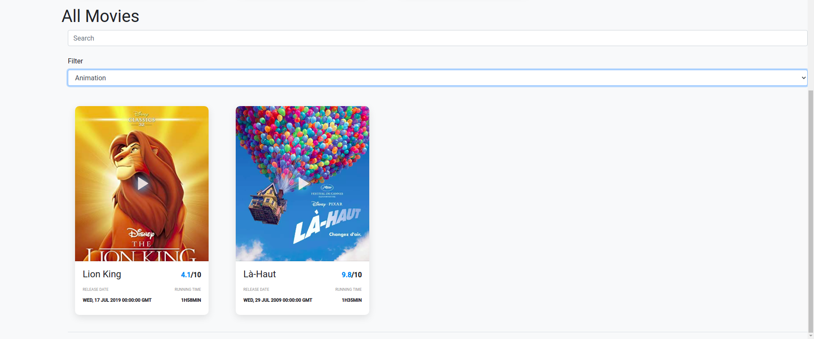
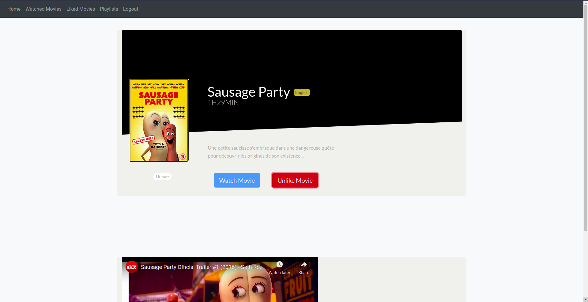
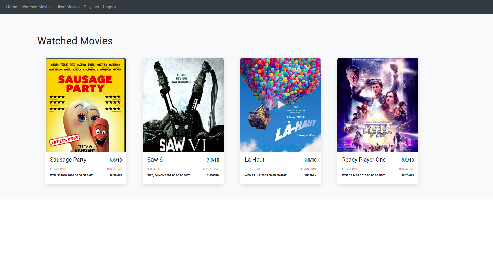
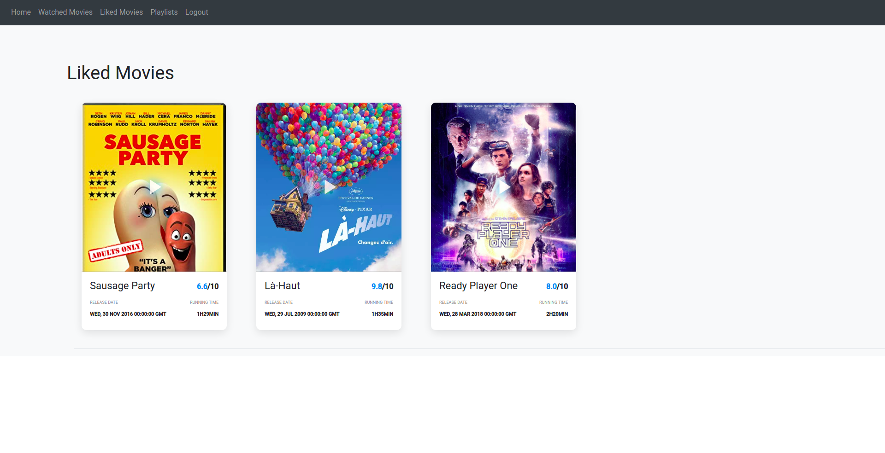

# :movie_camera: Movie Web App Example :movie_camera:

   [](https://opensource.org/licenses/MIT)

A simple example of a web application about movies. You can register and log in you to select your favorites movies and group them in one place.

## Table of Contents
- 1. [Getting Started](#getting-started)
- 2. [Website Presentation](#website-pres)
- 3. [License](#license)

## Getting Started

### 0. Dependencies :books:

The entire project is based on containers to make the deploy easier. You must have [Docker :whale: ](https://docs.docker.com/get-docker/) installed in your environment.

### 1. Clone project :file_folder:

```bash
git clone https://github.com/Mitix-EPI/NeoMovie
cd NeoMovie
```

### 2. Running the project :rocket:

```bash
docker-compose build # Build containers
docker-compose up # Run each containers (Web / Api / DB)
```

The site should now be served on http://localhost:5000.

### 3. Adminer :cyclone:

An adminer is working on http://localhost:8080 and can help you adding movies easily.

<div id='website-pres'/>

## :camera: Website presentation :camera:

#### Home Page


#### Register




#### Login



#### Movies Menu





#### Filtering Movies





#### Movies Details



#### Movies Watched



#### Movies Liked



## License

Distributed under the MIT License. See `License` for more details.
